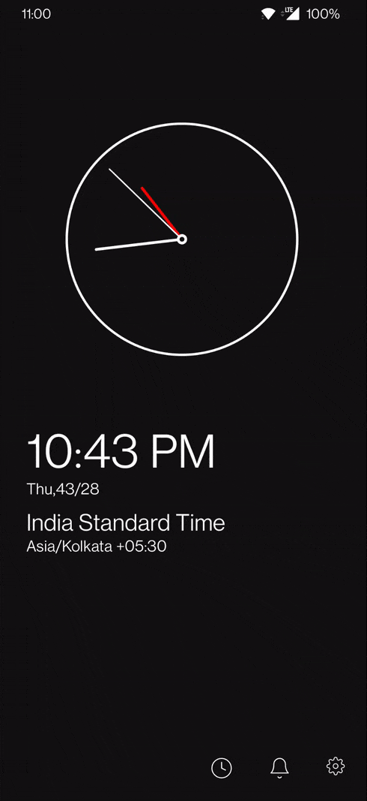
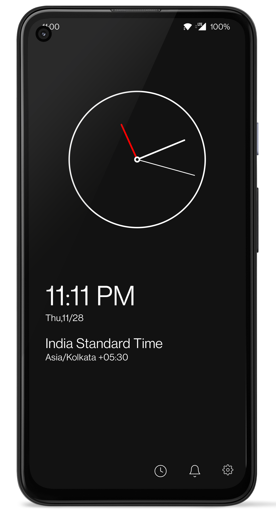
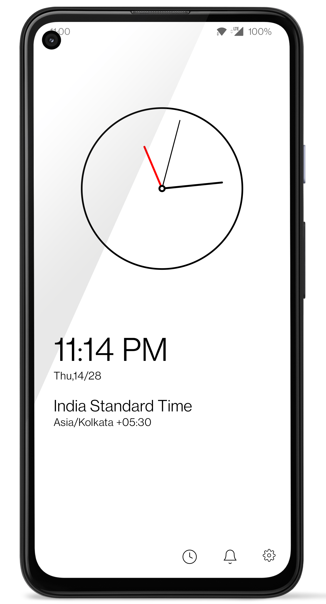
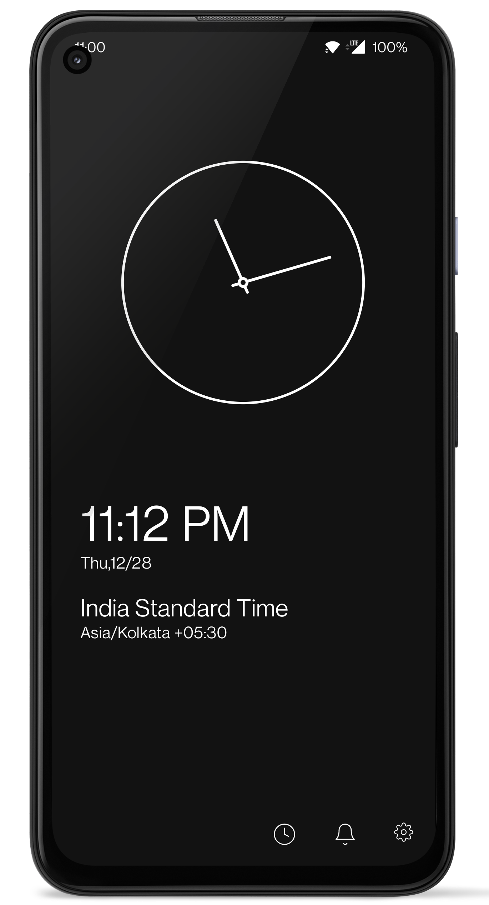
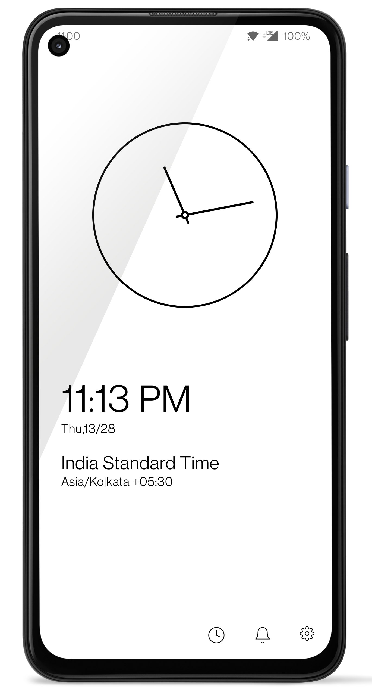

# JetAlarm [Under Development]
JetAlarm is an Android Application written on Jetpack-Compose 
It follows MVVM Architecture and include below librries

1. [Jetpack-Compose](https://developer.android.com/jetpack/compose)
2. [Room](https://developer.android.com/reference/android/arch/persistence/room/RoomDatabase)
3. [Coroutines](https://developer.android.com/kotlin/coroutines)
4. [DataStore](https://developer.android.com/topic/libraries/architecture/datastore)
5. [Navigation](https://developer.android.com/jetpack/compose/navigation)
6. [Koin](https://insert-koin.io/)
  

.

  

Screenshots
-----------

  
Whats Coming Next
----------------
Currenty JetAlarm only contains a Clock screen, rest of the full fledged Alarm app functionality is on its way.

License
-----------------
Licensed under the Apache License, Version 2.0, [click here for the full license](/LICENSE).

Author & support
-----------------
This project was created by [Akshay Sharma](https://akshay2211.github.io/).

If this project help you reduce time to develop, you can give me a cup of coffee :) 

